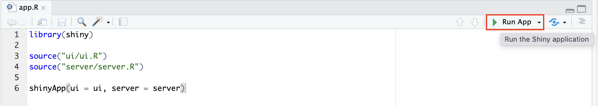

# Комплексное программное задание (KPZ): Анализ GitHub пользователя

Это Shiny-приложение позволяет проводить комплексный анализ активности пользователя GitHub. Приложение предоставляет интерактивные инструменты для изучения репозиториев, коммитов, языков программирования и паттернов активности с использованием современных методов визуализации и ML.

Подробная информация содержится в [GitHub Wiki](https://github.com/NotAccess/KPZ/wiki)

## Требования

- Установленный R (https://www.r-project.org/) (R ≥ 4.0)
- Установленный RStudio (рекомендуется, но не обязательно)
- Установленные пакеты:
  ```R
  install.packages(c("shiny", "httr", "dplyr", "purrr", "DT", "shinycssloaders", "plotly", "ggplot2", "tidyr", "fastDummies", "shinyjs", "shinyBS", "duckdb", "DBI", "litedown", "markdown", "stringr", "jsonlite", "tools", "lubridate", "yaml", "readr", "futile.logger"))
  ```

## Как запустить приложение
1. Склонируйте репозиторий:
   ```bash
   git clone https://github.com/NotAccess/KPZ
   ```
2. Установите рабочую директорию в R:
   ```R
   setwd("путь/к/папке/с/файлами")
   ```
3. Настройте переменные окружения:
   * Откройте файл `.Renviron` для редактирования:
     ```bash
     usethis::edit_r_environ('project')
     ```
   * В открывшийся файл добавьте:
     ```
     GITHUB_TOKEN=`ваш_токен`
     YANDEX_FOLDER_ID=`идентификатор_каталога`
     YANDEX_API_KEY=`ваш_yandex_api_ключ`
     DUCK_DB=`название_базы_данных`
     COMMITS_TABLE=`название_таблицы_коммитов`
     ```
   * Активируйте настройки с помощью перезагрузки R сессии:
     ```bash
     .rs.restartR()
     ```

> [!TIP]
> **Где взять данные:**
> - `GITHUB_TOKEN`: Создайте в [настройках GitHub](https://github.com/settings/tokens) [инструкция по созданию](https://github.com/NotAccess/KPZ/wiki/Token)
> - `YANDEX_FOLDER_ID`: Идентификатор каталога в [Yandex Cloud](https://console.cloud.yandex.ru/folders)
> - `YANDEX_API_KEY`: Создайте в сервисном аккаунте на странице каталога
> - `DUCK_DB` и `COMMITS_TABLE` могут иметь любое название 

> [!IMPORTANT]
> - Без GitHub токена работа с API ограничена 60 запросами/час
> - Все переменные из `.Renviron` должны быть указаны БЕЗ пробелов вокруг `=`
> - Файл `.Renviron` должен находиться в корне проекта
> - После изменения переменных всегда перезагружайте R сессию!

4. Запустите приложение
   * Запуск через консоль:
   ```bash
     shiny::runApp()
   ```
   * Запуск через RStudio:
       1. Откройте склонироавнный репозиторий в RStudio
       2. Откройте файл app.R
       3. Запустите файл app.R с помощью кнопки в правом верхнем углу Run 

       
   
   
   
   
