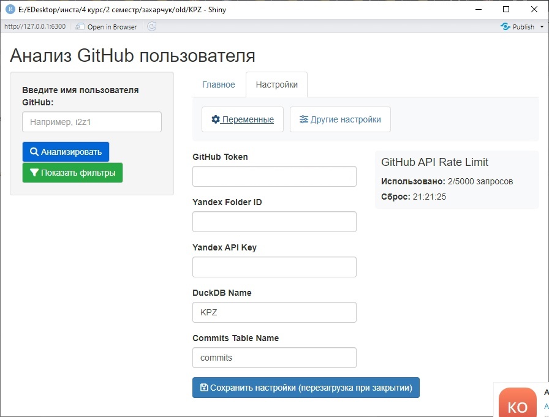

# Комплексное программное задание (KPZ): Анализ GitHub пользователя

Это Shiny-приложение позволяет проводить комплексный анализ активности пользователя GitHub. Приложение предоставляет интерактивные инструменты для изучения репозиториев, коммитов, языков программирования и паттернов активности с использованием современных методов визуализации и ML.

Подробная информация содержится на [сайте](https://notaccess.github.io/KPZ/).

## Требования

- Установленный [R версии 4.0 и выше](https://www.r-project.org/);
- Установленный [RStudio версии 2024.09 и выше](https://posit.co/download/rstudio-desktop/) (рекомендуется, но не обязательно);

## Первичная настройка
1. Склонируйте репозиторий:
   ```bash
   git clone https://github.com/NotAccess/KPZ
   ```
2. Установите рабочую директорию в R:
   ```R
   setwd("путь/к/папке/с/файлами")
   ```
3. Установленные пакеты:
  ```R
  install.packages(c("promises", "shiny", "httr2", "dplyr", "purrr", "DT", "shinycssloaders", "plotly", "ggplot2", "tidyr", "fastDummies", "shinyjs", "shinyBS", "duckdb", "DBI", "litedown", "markdown", "stringr", "jsonlite", "tools", "lubridate", "yaml", "readr", "futile.logger"))
  ```

## Как запустить приложение
1. Запустите приложение
   * Запуск через консоль R:
   ```bash
     shiny::runApp()
   ```
   * Запуск через RStudio:
       1. Откройте склонироавнный репозиторий в RStudio
       2. Откройте файл app.R
       3. Запустите файл app.R с помощью кнопки в правом верхнем углу Run 
       
2. Настройте переменные окружения:
   * Выберите вкладку настройки
   * Заполните переменные: 
     ```
     GITHUB_TOKEN=`ваш_токен`
     YANDEX_FOLDER_ID=`идентификатор_каталога`
     YANDEX_API_KEY=`ваш_yandex_api_ключ`
     DUCK_DB=`название_базы_данных`
     COMMITS_TABLE=`название_таблицы_коммитов`
     ```
     
   * Сохраните настройки
3. Вновь запустите приложение 

> [!TIP]
> **Где взять данные:**
> - `GITHUB_TOKEN`: Создайте в [настройках GitHub](https://github.com/settings/tokens) [инструкция по созданию](https://github.com/NotAccess/KPZ/wiki/Token)
> - `YANDEX_FOLDER_ID`: Идентификатор каталога в [Yandex Cloud](https://console.cloud.yandex.ru/folders)
> - `YANDEX_API_KEY`: Создайте в сервисном аккаунте на странице каталога
> - `DUCK_DB` и `COMMITS_TABLE` могут иметь любое название 

> [!IMPORTANT]
> - Без GitHub токена работа с API ограничена 60 запросами/час
> - После изменения переменных перезапускайте приложение!
    
## Функциональность

- **Анализ репозиториев**
  - Загрузка и фильтрация репозиториев по 8+ параметрам
  - Детальная статистика: звёзды, форки, issues, участники
  - Интерактивные временные фильтры (создание/обновление)
  - Визуализация метрик в виде интерактивных карточек

- **Анализ коммитов**
  - Полная история изменений с дезагрегацией до уровня файлов
  - Расширенная аналитика: добавления/удаления, типы изменений
  - Интеллектуальная группировка по авторам и репозиториям
  
- **Продвинутая аналитика**
  - **Временные паттерны**:
    - Тепловая карта активности (дни недели × часы)
    - Динамика событий (issues/форки) на временной шкале
  - **Языковой анализ**:
    - Распределение языков программирования
    - Детекция файлов по расширениям
  - **ML-анализ**:
    - PCA-визуализация многомерного пространства коммитов
    - Интерактивное исследование кластеров активности

## Архитектура решения

```s
project/ 
├── app.R             # Главный файл
├── server/
│ ├── server.R        # Главный серверный модуль
│ ├── ETL.R           # Пайплайны данных (API → DataFrame)
│ ├── ML.R            # ML-модели и преобразования
│ └── data/  
|   ├── promt         # Промт для ML-модели 
|   └── schema.json   # Схема для отчета
├── ui/
│ └── ui.R            # Пользовательский интерфейс
└── README.md         # Документация
```
