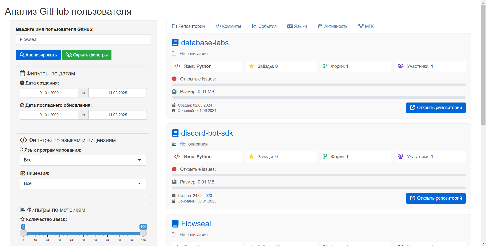
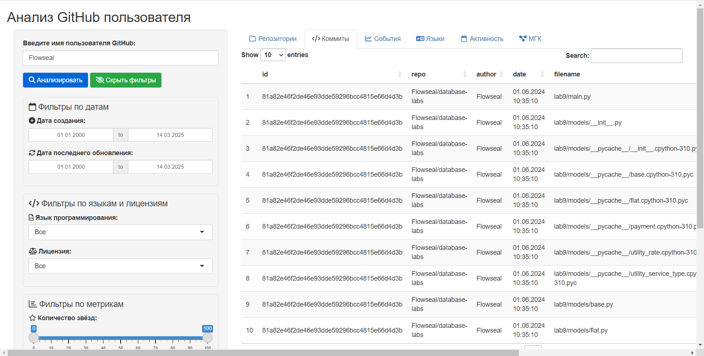
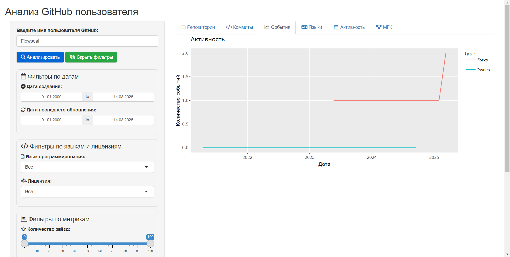
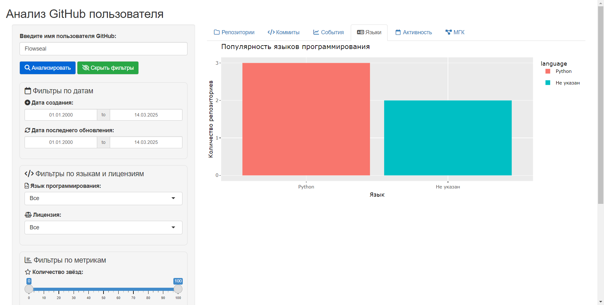

```{r setup, include=FALSE}
knitr::opts_chunk$set(echo = FALSE)
```

## Цели 

Проект может быть использован для следующих целей:

* анализ благонадёжности пользователя как контрагента на основании его поведенческого профиля;
* детектирование аномалий для предотвращения подмены кода в разрабатываемых проектах.


### <span style="color:#515151"> Поведенческий профиль </span>

Поведенческий профиль разработчика создаётся на основе его коммитов в репозитории своего профиля (по умолчанию - за год)

## Архитектура 

<span style="color:#515151"> Форма представления проекта: </span> shiny-приложение 

Проект разделён на две части: серверную часть (server) и часть графического представления (ui)

* <span style="color:#515151"> server </span>
  + ETL.R - функции, относящиеся к этапу ETL
  + ML.R - функции, относящиеся к этапу машинного обучения
  + server.R - серверная часть приложения
* <span style="color:#515151"> ui </span>
  + ui.R - графическая часть приложения 
* <span style="color:#515151"> app.R </span> - подключение серверной части и части графического представления  

## Стек технологий

Будут использованы следующие технологии: 

* Backend: R 
* Frontend: Shiny
* Data processing: dplyr, purrr, httr, dummy
* Визуализация: ggplot2, plotly, heatmaps
* ML: PCA
* Интеграции: GitHub API v3


# Фаза ETL данных

## Работа с репозиториями

<div class="columns-2">
<div class="centered">GitHub API</div>
<div class="centered">
```{r, out.width = "500px", out.height= "500px", fig.cap= "", echo=FALSE}
knitr::include_graphics("img/github-mark.png")
```
</div>

### Поэтапное формирование ETL

1. Получение списка репозиториев разработчика;
2. На основе полученной информации о репозиториях:
    1. Формирование списка коммитов;
    2. Формирование данных о forks и issues;
    3. Формирование списка используемых ЯП;
    4. Формирование тепловой карты по датам коммитов.
</div>


# Фаза аналитики & ML

## Обработка данных

<div class="columns-2">
Анализ характера вносимых изменений производится подсчётом количества добавленных, удалённых и изменённых строк.

Создание профиля разработчика происходит на основе данных о коммитах в его репозиториях. Подсчёт аномалий, на данный момент, высчитывается Методом главных компонент.

### Нормализация данных, поэтапно:
1. С помощью dummy, признаки разбиваются с категориальных на некатегориальные;
2. Агрегация по сумме данных о коммитах;
3. Определение главных компонентов;
4. Определение аномалий по порогу выброса.
</div>


# Фаза визуализации

## Профиль разработчика

<div class="centered">Визуализация простроена на Shiny.</div>
<div class="centered">
```{r, out.width = "450px", out.height= "450px", fig.cap= "", echo=FALSE}


```
</div>


# Прототип

------------------------------------------------------------------------

Список репозиториев

```{r, out.width = "900px", out.height= "450px", fig.cap= "", echo=FALSE}


```

------------------------------------------------------------------------

Список коммитов

```{r, out.width = "900px", out.height= "450px", fig.cap= "", echo=FALSE}


```

------------------------------------------------------------------------

События

```{r, out.width = "900px", out.height= "450px", fig.cap= "", echo=FALSE}


```

------------------------------------------------------------------------

Распределение используемых языков

```{r, out.width = "900px", out.height= "450px", fig.cap= "", echo=FALSE}


```

------------------------------------------------------------------------

Тепловая карта активности

```{r, out.width = "900px", out.height= "450px", fig.cap= "", echo=FALSE}

knitr::include_graphics("img/acts.png")
```

------------------------------------------------------------------------

Подсчёт аномалий

```{r, out.width = "900px", out.height= "450px", fig.cap= "", echo=FALSE}

knitr::include_graphics("img/pca.png")
```
