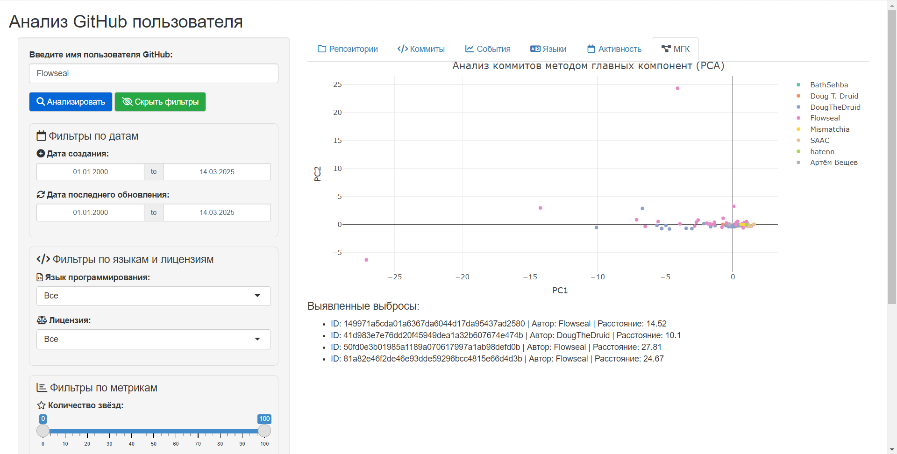

```{r setup, include=FALSE}
knitr::opts_chunk$set(echo = FALSE)
```

## Цели 

Проект может быть использован для следующих целей:

* анализ благонадёжности пользователя как контрагента на основании его поведенческого профиля;
* детектирование аномалий для предотвращения подмены кода в разрабатываемых проектах.


### <span style="color:#515151"> Поведенческий профиль </span>

Поведенческий профиль разработчика создаётся на основе его коммитов в репозитории своего профиля (по умолчанию - за год)

## Архитектура 

<span style="color:#515151"> Форма представления проекта: </span> shiny-приложение 

Проект разделён на две части: серверную часть (server) и часть графического представления (ui)

* <span style="color:#515151"> server </span>
  + ETL.R - функции, относящиеся к этапу ETL
  + ML.R - функции, относящиеся к этапу машинного обучения
  + server.R - серверная часть приложения
* <span style="color:#515151"> ui </span>
  + ui.R - графическая часть приложения 
* <span style="color:#515151"> app.R </span> - подключение серверной части и части графического представления  

## Стек технологий

Будут использованы следующие технологии: 

* Backend: R 
* Frontend: Shiny
* Data processing: dplyr, purrr, httr, dummy
* Визуализация: ggplot2, plotly, heatmaps
* ML: PCA
* Интеграции: GitHub API v3

# Фаза ETL данных

## Извлечение информации о коммитах

Извлечение происходит с помощью Github API. Скачивается информация о всех репозиториях, по странично, затем информация о всех коммитах всех репозиториев разработчика. Ограничение по 100 элементов за раз.

Github API обеспечивает по 5000/час запросов. Без него, скорость падает до 60/час запросов.

## Построение хронологически последовательной истории изменений файлов репозитория

# Фаза аналитики & ML

## Нормализация данных

С помощью dummy, признаки разбиваются с категориальных на некатегориальные. Далее происходит агрегация по сумме данных о коммитах.

## Анализ характера вносимых изменений

Происходит подсчёт количества добавленных, удалённых и изменённых строк.

## Создание профиля разработчика

Профиль формируется на основе данных о коммитах. Подсчёт аномалий, на данный момент, высчитывается Методом главных компонент.

# Фаза визуализации

## Профиль разработчика

Содержит: Список репозиториев

```{r, out.width = "900px", out.height= "450px", fig.cap= "", echo=FALSE}

knitr::include_graphics("img/strt.png")
```

------------------------------------------------------------------------

Список коммитов

```{r, out.width = "900px", out.height= "450px", fig.cap= "", echo=FALSE}

knitr::include_graphics("img/coms.png")
```

------------------------------------------------------------------------

События

```{r, out.width = "900px", out.height= "450px", fig.cap= "", echo=FALSE}

knitr::include_graphics("img/haps.png")
```

------------------------------------------------------------------------

Распределение используемых языков

```{r, out.width = "900px", out.height= "450px", fig.cap= "", echo=FALSE}

knitr::include_graphics("img/langs.png")
```

------------------------------------------------------------------------

Тепловая карта активности

```{r, out.width = "900px", out.height= "450px", fig.cap= "", echo=FALSE}

knitr::include_graphics("img/acts.png")
```

------------------------------------------------------------------------

Подсчёт аномалий

```{r, out.width = "900px", out.height= "450px", fig.cap= "", echo=FALSE}


```
