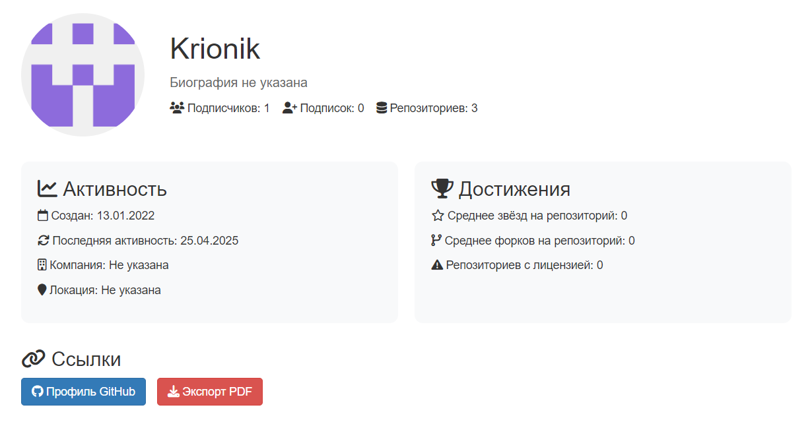
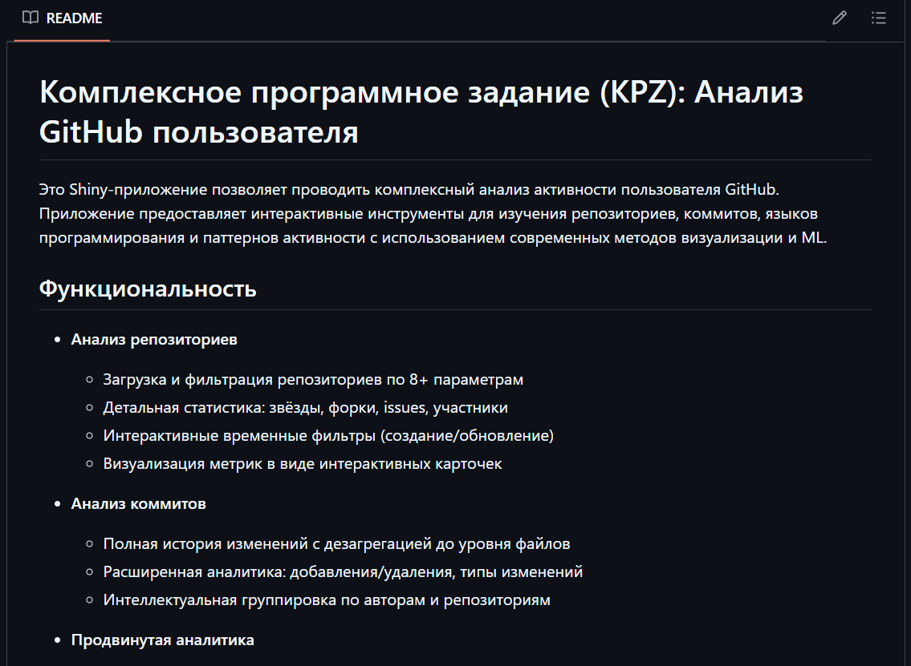
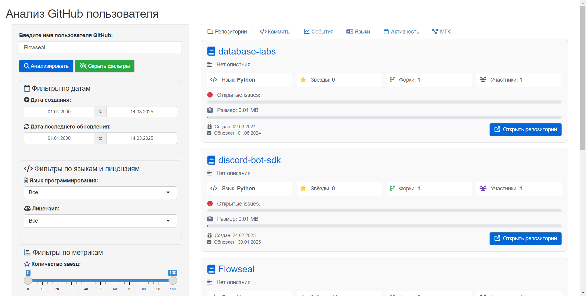
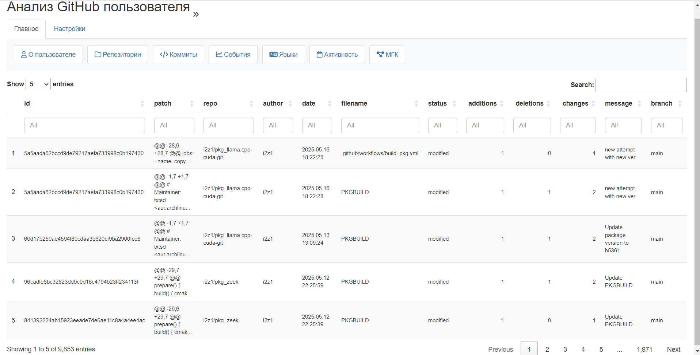
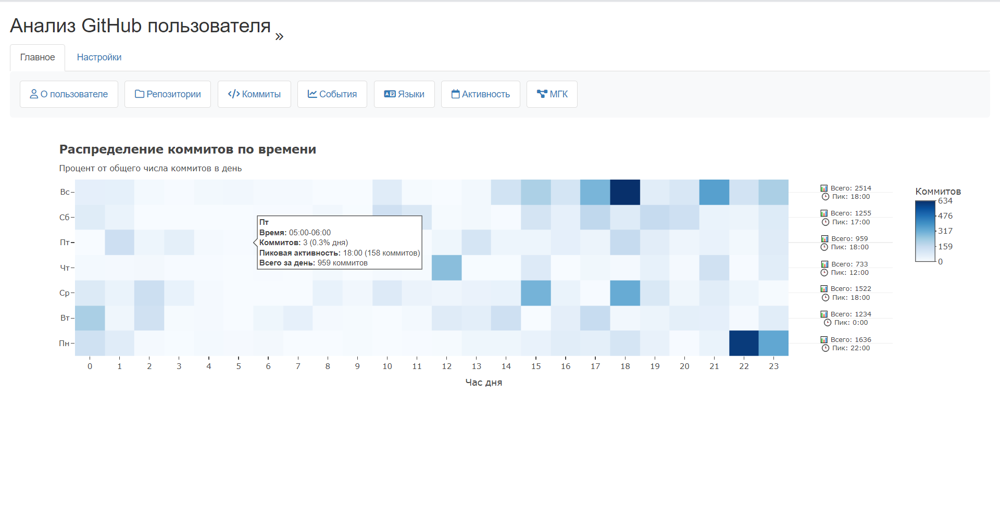

```{r setup, include=FALSE}
knitr::opts_chunk$set(echo = FALSE)
```

## Цели

Проект может быть использован для следующих целей:

-   анализ благонадёжности пользователя как контрагента на основании его поведенческого профиля;
-   детектирование аномалий для предотвращения подмены кода в разрабатываемых проектах.

### [ Поведенческий профиль ]{style="color:#515151"}

Поведенческий профиль разработчика создаётся на основе его коммитов в репозитории своего профиля (по умолчанию - за год)

## Архитектура

[ Форма представления проекта: ]{style="color:#515151"} shiny-приложение

Проект разделён на две части: серверную часть (server) и часть графического представления (ui)

-   [ server ]{style="color:#515151"}
    -   ETL.R - функции, относящиеся к этапу ETL
    -   ML.R - функции, относящиеся к этапу машинного обучения
    -   server.R - серверная часть приложения
-   [ ui ]{style="color:#515151"}
    -   ui.R - графическая часть приложения
-   [ app.R ]{style="color:#515151"} - подключение серверной части и части графического представления

## Стек технологий

Будут использованы следующие технологии:

-   Backend: R
-   Frontend: Shiny
-   Data processing: dplyr, purrr, httr, dummy
-   Визуализация: ggplot2, plotly, heatmaps
-   ML: PCA
-   Интеграции: GitHub API v3

# Фаза ETL данных

## Работа с репозиториями

::: columns-2
::: centered
GitHub API
:::

::: centered
```{r, out.width = "500px", out.height= "500px", fig.cap= "", echo=FALSE}
knitr::include_graphics("img/github-mark.png")
```
:::

### Поэтапное формирование ETL

1.  Получение списка репозиториев разработчика;
2.  На основе полученной информации о репозиториях:
    1.  Формирование списка коммитов;
    2.  Формирование данных о forks и issues;
    3.  Формирование списка используемых ЯП;
    4.  Формирование тепловой карты по датам коммитов.
:::

## Программная реализация 
::: columns-2
::: left
### Используемые библиотеки:
:::
- httr - зашрузка данных из API;
- dplyr - очистка, преобразование и агрегирование данных, полученных из API; 
- purrr - преобразование данных и обработка ошибок. 

### Реализованные функции:

- github_api_get
- get_user_repos
- get_user_commits_dа
- prepare_language_data
- prepare_commit_heatmap_data
:::

## github_api_get
<div style="margin-left: 60px;">
```R
github_api_get <- function(url) {
  ...
  return(response)
}
```
</div>
Принимает URL GitHub API в качестве аргумента и возвращает объект ответа (response) от сервера GitHub после выполнения GET-запроса. Она также обрабатывает различные сценарии ошибок и предупреждений, связанные с API.


Входные данные: 

- url - URL-адрес

Выходные данные:

- response - ответ от GitHub API

## get_user_repos
<div style="margin-left: 60px;">
```R
get_user_repos <- function(username, setProgress = NULL) {
  ...
  return(repo_data)
}
```
</div>
Функция предназначена для получения списка репозиториев пользователя. Она использует API GitHub, разбивает запрос на страницы, если репозиториев много, и возвращает список с информацией о каждом репозитории.

Входные данные: 

- url - URL-адрес
- setProgress (необязательный) - отображение прогресса выполнения

Выходные данные:

- repo_data - список информации о репозиториях пользователя

## get_user_commits_df
<div style="margin-left: 60px;">
```R
get_user_commits_df <- function(repos, setProgress = NULL) {
  commits_df <- data.frame(
    id = character(),
    repo = character(),
    author = character(),
    date = as.POSIXct(character()),
    filename = character(),
    status = character(),
    additions = numeric(),
    deletions = numeric(),
    changes = numeric(),
    message = character(),
    branch = character(),  # добавляем поле для ветки
    stringsAsFactors = FALSE
  )
  ...
  return(commits_df)
}
```
</div>

------------------------------------------------------------------------

Извлекает информацию о коммитах из всех веток указанных репозиториев GitHub и формирует таблицу с характеристиками каждого коммита и измененных файлов.

Входные данные: 

- repos - список объектов, представляющих репозитории GitHub
- setProgress (необязательный) - отображение прогресса выполнения

Выходные данные:

- commits_df - data frame, содержащий информацию о коммитах.

## prepare_language_data
<div style="margin-left: 60px;">
```R
prepare_language_data <- function(repos) {
  ...
  return(language_data)
}
```
</div>
Анализирует список репозиториев и формирует сводную таблицу с информацией о языках программирования, используемых в этих репозиториях.

Входные данные: 

- repos - список объектов, представляющих репозитории GitHub

Выходные данные:

- language_data - data frame, содержащий информацию об использовании языков.

## prepare_commit_heatmap_data
<div style="margin-left: 60px;">
```R
prepare_commit_heatmap_data <- function(commits) {
  ...
  return(heatmap_data)
}
```
</div>

Подготавливает данные о коммитах для построения тепловой карты, показывающей распределение коммитов по дням недели и часам суток.

Входные данные: 

- commits - data frame,содержащий информацию о коммитах.

Выходные данные:

- heatmap_data - data frame, пригодный для построения тепловой карты.

# Фаза аналитики & ML

## Обработка данных

::: columns-2
Анализ характера вносимых изменений производится подсчётом количества добавленных, удалённых и изменённых строк.

Создание профиля разработчика происходит на основе данных о коммитах в его репозиториях. Подсчёт аномалий, на данный момент, высчитывается Методом главных компонент.

### Нормализация данных, поэтапно:

1.  С помощью dummy, признаки разбиваются с категориальных на некатегориальные;
2.  Агрегация данных о коммитах;
3.  Нормализация методом MinMax;
4.  Определение главных компонентов;
5.  Определение аномалий по порогу выброса.
:::

# Фаза визуализации

## Профиль разработчика

::: centered
Визуализация простроена на Shiny.
:::

::: centered
```{r, out.width = "450px", out.height= "450px", fig.cap= "", echo=FALSE}

knitr::include_graphics("img/Shiny_hex_logo.png")
```
:::

------------------------------------------------------------------------

::: centered
Автоотчёт
:::

::: centered
```{r, out.width = "800px", out.height= "450px", fig.cap= "", echo=FALSE}


```
:::

# Документация

------------------------------------------------------------------------

::: centered
Документация в README
:::

::: centered
```{r, out.width = "600px", out.height= "450px", fig.cap= "", echo=FALSE}


```
:::

# Прототип

------------------------------------------------------------------------

Список репозиториев

```{r, out.width = "900px", out.height= "450px", fig.cap= "", echo=FALSE}


```

------------------------------------------------------------------------

Список коммитов

```{r, out.width = "900px", out.height= "450px", fig.cap= "", echo=FALSE}


```

------------------------------------------------------------------------

События

```{r, out.width = "900px", out.height= "450px", fig.cap= "", echo=FALSE}

knitr::include_graphics("img/haps.png")
```

------------------------------------------------------------------------

Распределение используемых языков

```{r, out.width = "900px", out.height= "450px", fig.cap= "", echo=FALSE}

knitr::include_graphics("img/langs.png")
```

------------------------------------------------------------------------

Тепловая карта активности

```{r, out.width = "900px", out.height= "450px", fig.cap= "", echo=FALSE}


```

------------------------------------------------------------------------

Подсчёт аномалий

```{r, out.width = "900px", out.height= "450px", fig.cap= "", echo=FALSE}

knitr::include_graphics("img/pca.png")
```
