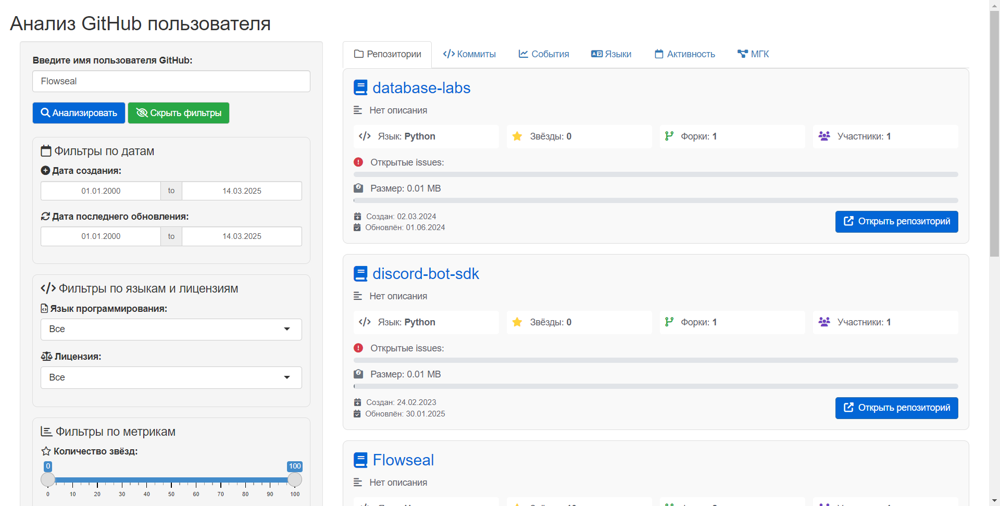

```{r setup, include=FALSE}
knitr::opts_chunk$set(echo = FALSE)
```

# Фаза ETL данных

## Работа с репозиториями

::: columns-2
::: centered
GitHub API
:::

::: centered
```{r, out.width = "500px", out.height= "500px", fig.cap= "", echo=FALSE}
knitr::include_graphics("img/github-mark.png")
```
:::

### Поэтапное формирование ETL

1.  Получение списка репозиториев разработчика;
2.  На основе полученной информации о репозиториях:
    1.  Формирование списка коммитов;
    2.  Формирование данных о forks и issues;
    3.  Формирование списка используемых ЯП;
    4.  Формирование тепловой карты по датам коммитов.
:::

# Фаза аналитики & ML

## Обработка данных

::: columns-2
Анализ характера вносимых изменений производится подсчётом количества добавленных, удалённых и изменённых строк.

Создание профиля разработчика происходит на основе данных о коммитах в его репозиториях. Подсчёт аномалий, на данный момент, высчитывается Методом главных компонент.

### Нормализация данных, поэтапно:

1.  С помощью dummy, признаки разбиваются с категориальных на некатегориальные;
2.  Агрегация по сумме данных о коммитах;
3.  Определение главных компонентов;
4.  Определение аномалий по порогу выброса.
:::

# Фаза визуализации

## Профиль разработчика

::: centered
Визуализация простроена на Shiny.
:::

::: centered
```{r, out.width = "450px", out.height= "450px", fig.cap= "", echo=FALSE}

knitr::include_graphics("img/Shiny_hex_logo.png")
```
:::

# Прототип

------------------------------------------------------------------------

Список репозиториев

```{r, out.width = "900px", out.height= "450px", fig.cap= "", echo=FALSE}


```

------------------------------------------------------------------------

Список коммитов

```{r, out.width = "900px", out.height= "450px", fig.cap= "", echo=FALSE}


```

------------------------------------------------------------------------

События

```{r, out.width = "900px", out.height= "450px", fig.cap= "", echo=FALSE}


```

------------------------------------------------------------------------

Распределение используемых языков

```{r, out.width = "900px", out.height= "450px", fig.cap= "", echo=FALSE}


```

------------------------------------------------------------------------

Тепловая карта активности

```{r, out.width = "900px", out.height= "450px", fig.cap= "", echo=FALSE}


```

------------------------------------------------------------------------

Подсчёт аномалий

```{r, out.width = "900px", out.height= "450px", fig.cap= "", echo=FALSE}

knitr::include_graphics("img/pca.png")
```
